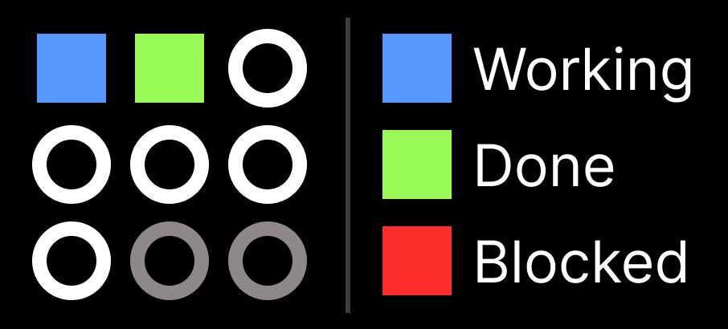

# HerdEye


A small macOS menu bar app for monitoring [herdr](https://github.com/ogulcancelik/herdr) agent status.

HerdEye watches the agents running inside your herdr sessions and shows their
status as a compact dot grid in the menu bar — so you can tell, at a glance,
which agents are working, blocked, done, or idle without switching windows.

It runs as a background-only app (no Dock icon, no window) and needs no
HerdEye-specific configuration on the herdr side: it just connects to the
standard herdr socket.

## Features

- **Menu bar dot grid.** Up to nine agents are summarized as a 3×3 grid (a 2×2
  grid when four or fewer agents exist). Each dot's shape, fill, and color
  reflect that agent's state.
- **State prioritization.** Active agents are surfaced first. The grid fills
  top-left first by priority `blocked > working > done > idle > unknown`, so the
  dots that need your attention are always in the same place.
- **Click-to-expand popover.** Clicking the menu bar item opens a popover with
  the full agent list — workspace name, agent name and pane number, and current
  state — plus a live connection indicator (`Live`, `Connecting`, `Reconnect #n`).
- **Customizable appearance.** The shape (circle/square), outline, and fill color
  for each state are adjustable in Settings and persist across launches.
- **Robust connection.** HerdEye tracks pane lifetimes, re-subscribes when the
  set of known panes changes, and reconnects with backoff if herdr restarts.

### Agent states and default appearance

HerdEye mirrors herdr's reported states without custom interpretation.

| State   | Meaning                              | Default dot          |
| ------- | ------------------------------------ | -------------------- |
| blocked | Agent is waiting for input/attention | Filled red square    |
| working | Agent is actively running            | Filled blue square   |
| done    | Agent finished its turn              | Filled green square  |
| idle    | Agent is waiting idle                | Gray circle outline  |
| unknown | State could not be determined        | Gray circle outline  |



## How it works

HerdEye connects to the herdr Unix-domain socket
(`~/.config/herdr/herdr.sock`) over a line-delimited JSON protocol:

1. On connect it subscribes to events and fetches a snapshot of the current
   panes and workspaces to seed the agent list.
2. It then streams `pane.agent_status_changed`, `pane.agent_detected`,
   `pane.closed`, `pane.moved`, and workspace lifecycle events to keep the list live.
3. Because `events.subscribe` can only be sent once per connection, HerdEye
   reconnects whenever the set of known panes changes, batching rapid changes
   to avoid churn.

Only panes with a detected agent are tracked; transient herdr UI helper panes
are ignored. The communication and state-reduction logic is split into pure,
independently tested functions (see `HerdEye/Store/PastureReducer.swift`).

## Usage

1. Start herdr normally and let it expose its standard socket. No extra setup
   is needed.
2. Launch HerdEye. It appears as a dot grid in the menu bar and begins
   connecting automatically.
3. Glance at the menu bar to monitor your agents:
   - While connecting, slots appear as empty gray outlines.
   - Once live, each dot reflects an agent's state.
   - If you have more than nine agents, the popover notes how many were hidden
     (lower-priority states are dropped first).
4. **Click** the menu bar item to open the popover and see the full list, open
   Settings (gear icon), or quit HerdEye.
5. **Settings → Dot Appearance** lets you change the shape, outline, and fill
   color for each state and reset to defaults.

> HerdEye is a background-only app. To quit it, use the **Quit HerdEye** button
> in the popover.

## Requirements

- macOS 26 or later
- Xcode 26 or later
- XcodeGen 2.45.4 or later
- herdr

No HerdEye-specific configuration is required on the herdr side. HerdEye works
when herdr exposes its standard socket.

## Build

XcodeGen is required. Install it, then run:

```sh
brew install xcodegen
xcodegen generate
xcodebuild -project HerdEye.xcodeproj -scheme HerdEye -configuration Debug CODE_SIGNING_ALLOWED=NO build
```

## Distribution (signed and notarized DMG)

HerdEye is non-sandboxed, so it is distributed outside the App Store as a
Developer ID-signed, notarized DMG. The archive is built in Xcode locally;
`scripts/package-dmg.sh` then packages, notarizes, and staples the DMG.

### Prerequisites

- An **Apple Developer Program** membership and a **Developer ID Application**
  certificate installed in Keychain.
- An **App Store Connect API Key** (App Store Connect → Users and Access → Keys)
  with Developer access. Download the `.p8` and note its **Key ID** and
  **Issuer ID**.
- `create-dmg`:

  ```sh
  brew install create-dmg
  ```

- Your signing team and bundle identifier in `Config/Local.xcconfig`:

  ```sh
  cp Config/Local.xcconfig.example Config/Local.xcconfig
  # then set:
  #   DEVELOPMENT_TEAM = <TEAMID>
  #   PRODUCT_BUNDLE_IDENTIFIER = com.<yourname>.HerdEye
  ```

### 1. Export a signed app

Generate the Xcode project (see [Build](#build)) and open it in Xcode.
**Product → Archive**, then in the Organizer choose **Distribute App → Copy App**
to export a **Developer ID-signed** `.app` (signed, but not yet notarized).

### 2. Package, notarize, and staple

```sh
export AC_API_KEY_ID=ABCDE12345
export AC_API_KEY_ISSUER=12345678-abcd-...
export AC_API_KEY_PATH=/path/AuthKey_ABCDE12345.p8
scripts/package-dmg.sh path/to/exported/HerdEye.app
```

This produces `dist/HerdEye-<version>.dmg`, notarized and stapled.

### 3. Verify

```sh
xcrun stapler validate dist/HerdEye-<version>.dmg
spctl --assess -t open --context context:primary-signature dist/HerdEye-<version>.dmg
```

### Distribute

Attach the DMG to a **GitHub Release** (versioned tag), or host it directly.

## Tests

The core tests use Swift Testing and run through Swift Package Manager without
generating the Xcode project:

```sh
swift test
```

To specify a personal bundle identifier or signing team, copy and edit the
example configuration:

```sh
cp Config/Local.xcconfig.example Config/Local.xcconfig
```

## License

MIT License. See [LICENSE](LICENSE) for details.
